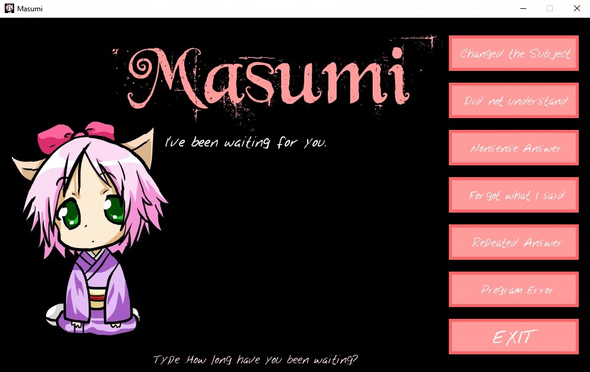

# MasumiProject
An Artificial Conversational Agent for increasing attentiveness in ADHD sufferers. Created for a dissertation project during my participation on a BSc (Hons) Computing degree program, the interface is animated and designed for young users.  
Requirements: Python3, PyGame
  

